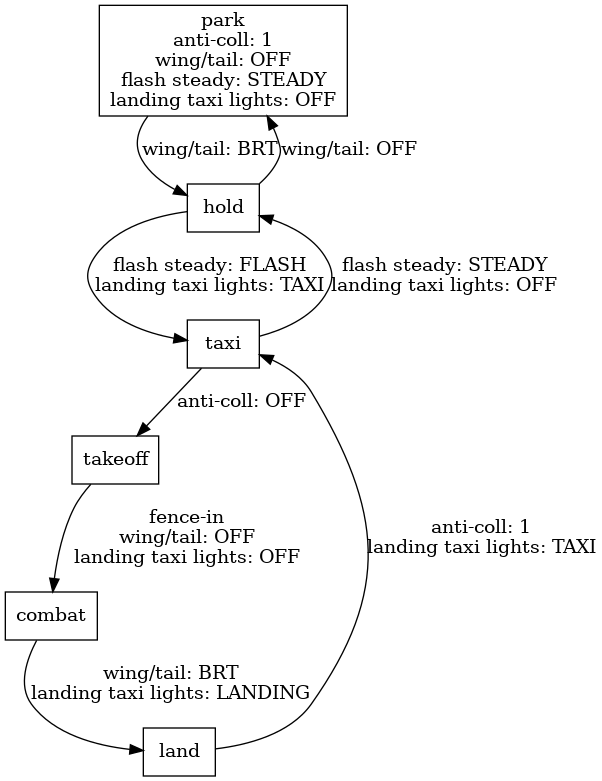

F-16C Viper
===========

Engine Start
------------

.. NOTE::
   Unlike other airframes the Viper needs no ground power to spool up.

FUEL
  - ensure ENGINE FEED knob is set to NORM

ELEC
  - set MAIN PWR switch to MAIN PWR
  
ENG & JET START
  - set JFS switch to START 2
  - wait for the green JFS RUN light to go on and the RPM to reach 25%

Throttle
  - switch to IDLE position (``rshift-home`` by default)
  - make sure the FTIT does not exceed 900°C
  - wait for the RPM to reach 65%, the FTIT to settle at 400°C, and the oil pressure to settle at 27 psi

.. HINT::
   You can switch the trottle from IDLE back to the OFF position by pressing ``rshift-end``.

.. HINT::
   You can get rid of the ELEC SYS warning by pressing the CAUTION RESET button in the ELEC panel.

System Start
------------

AVIONICS POWER
  - set MMC switch to MMC
  - set ST STA switch to ST STA
  - set MFD switch to MFD
  - set UFC switch to UFC
  - set GPS switch to GPS
  - set DL switch to DL
  - wait for the DED to come online
  - set INS knob to NORM

SNSR PWR
  - set FCR switch to FCR
  - set RDR ALT switch to STBY

.. HINT::
   If the HUD hasn't come on automatically, turn up the ICP HUD symbology intensity knob.

IFF
  - set IFF MASTER knob to STBY
  - ensure C&I knob is set to UFC

THREAT WARNING AUX
  - enable RWR indicator control POWER button

CMDS
  - set RWR 555 switch to ON
  - set JMR source switch to ON
  - set CH expendable category switch to ON
  - set FL expendable category switch to ON
  - ensure PROGRAM knob is not BIT
  - set MODE knob to at least MAN

AVIONICS POWER
  - wait until the DED shows a flashing RDY in the INS line
  - set INS knob to NAV

Taxi
----

Take Off
--------

- close canopy (``lctl-C`` by default)
- set canopy handle (yellow spider) to DOWN
- set ejection safety lever to armed

Land
----

Radar Warning Receiver
----------------------

Light Discipline
----------------
In a hostile environment we turn off all lights. Otherwise, whenever we operate the plane we turn on the navigation lights. When the plane stands still, we set the navigation lights to steady. When the plane moves in any way, we set the navigation lights to flashing. Whenever we operate the plane on the ground, we turn on the anti-collision lights. Only while taxiing we turn on the taxi lights. Only while landing we turn on the landing lights.

========= ========= ============ ========= ===================
procedure anti-coll flash steady wing/tail landing taxi lights
========= ========= ============ ========= ===================
park      1                      OFF       OFF
hold      1         STEADY       BRT       OFF
taxi      1         FLASH        BRT       TAXI
takeoff   OFF       FLASH        BRT       TAXI
combat    OFF                    OFF       OFF
land      OFF       FLASH        BRT       LAND
========= ========= ============ ========= ===================

Radio
-----

Navigation
----------

Instrument Landing System
-------------------------

Air-to-Air Refueling
--------------------

Glossary
--------

ADI
  Attitude Direction Indicator. Artificial horizon.

DED
  Data Entry Display. Part of the UFC.

FTIT
  Fan Turbine Inlet Temperature.

HMCS
  Helmet Mounted Cueing System.

HSI
  Horizontal Situation Indicator.

HUD
  Heads-Up Display. Part of the UFC.

ICP
  Integrated Control Panel. Part of the UFC.

ILS
  Instrument Landing System.

MFD
  Multi-Function Display.

PFLD
  Pilot Fault List Display.

RPM
  Rotations Per Minute.

RWR
  Radar Warning Receiver.

UFC
  Up-Front Control. The UFC comprises the ICP, DED, and HUD.

