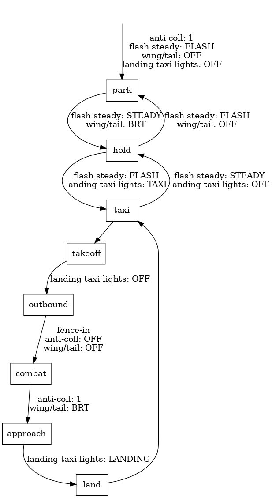
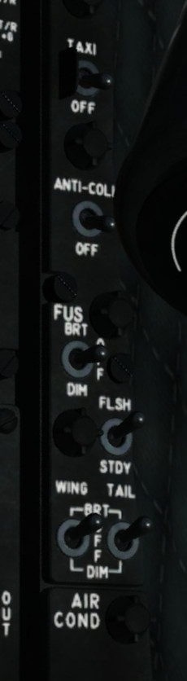

Lights
======

In a hostile environment we turn off all lights. Otherwise, whenever we operate the plane we turn on the navigation lights. When the plane stands still, we set the navigation lights to steady. When the plane moves in any way, we set the navigation lights to flashing. Whenever we operate the plane, we turn on the anti-collision lights. Only while taxiing we turn on the taxi lights. Only while landing we turn on the landing lights.

========= ========= ============ ========= ===================
procedure anti-coll flash steady wing/tail landing taxi lights
========= ========= ============ ========= ===================
park      1                      OFF       OFF
hold      1         STEADY       BRT       OFF
taxi      1         FLASH        BRT       TAXI or LAND
takeoff   1         FLASH        BRT       TAXI
outbound  1         FLASH        BRT       OFF
combat    OFF                    OFF       OFF
approach  1         FLASH        BRT       OFF
land      1         FLASH        BRT       LAND
========= ========= ============ ========= ===================

A4-E Skyhawk
------------

   A4-E Skyhawk exterior light panel (right leg)

F-16 Viper
----------
