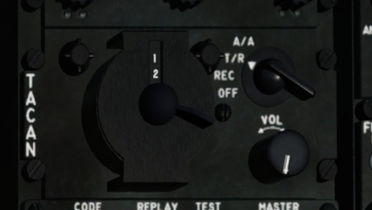
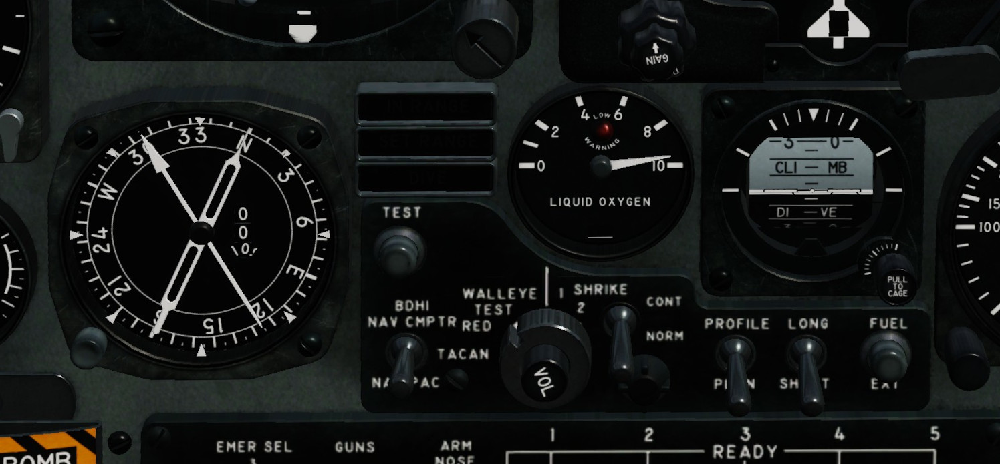

Navigation
==========

TACAN
-----

A4-E Skyhawk
^^^^^^^^^^^^

TACAN Panel
  - set AN/ARN-52 TACAN mode switch to T/R
  - select the TACAN channel using TACAN channel 10s and TACAN channel 1s dials

		 
   A4-E Skyhawk TACAN panel (right leg). Here, we selected channel 12.

Front Panel
  - ensure BDHI switch is set to TACAN

		 
   A4-E Skyhawk front panel navigation section. Here, our heading is 335 degree. The direction needle points due north and the distance to the TACAN transmitter is 0 nm.

F-16 Viper
^^^^^^^^^^

.. CAUTION::
   Make sure the MIDS LVT knob is set to ON.

- press 1 on the ICP to bring up the T-ILS page
- press ICP DCS SEQ until the DED reads TCN T/R
- press ICP data control switch DOWN to select the TACAN channel
- press ICP enter button
- press the mode button on the HSI until it reads TCN

Instrument Landing System
-------------------------

A4-E Skyhawk
^^^^^^^^^^^^

F-16 Viper
^^^^^^^^^^
