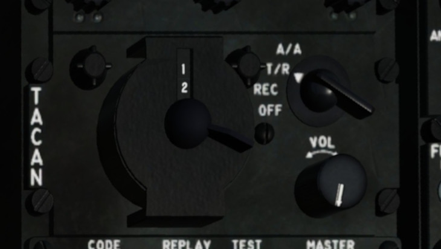

.. _navigation skyhawk:

Navigation A-4E Skyhawk
=======================

.. figure:: img/skyhawk_front_panel_nav.jpg
   :width: 70%
   :alt: A4-E Skyhawk front panel navigation section
		 
   A4-E Skyhawk front panel navigation section

Waypoint Navigation
-------------------

NAV Panel
  - set AN/APN-153 doppler navigation radar mode switch to LAND or SEA
  - set AN/ASN-41 function selector switch to SBTY
  - select the destination coordinates using destination latitude and destination longitude slew knobs
  - set AN/ASN-41 function selector switch to D1

   A4-E Skyhawk NAV panel (right leg)

Front Panel
  - set BDHI switch to NAV CMPTR
	
.. HINT::
   To navigate to a second destination, set the AN/ASN-41 function selector switch to D2, and select the coordinates. Now, switching between D1 and D2 toggles between both destinations.

TACAN
-----

TACAN Panel
  - set AN/ARN-52 TACAN mode switch to T/R
  - select the TACAN channel using TACAN channel 10s and TACAN channel 1s dials

		 
   A4-E Skyhawk TACAN panel (right leg)

Front Panel
  - ensure BDHI switch is set to TACAN

ILS
---

Right Leg
  - set AN/ARA-63 MCL power switch to ON
  - select the ILS channel using the MCL channel selector switch

   A4-E Skyhawk ILS panel (right leg)

