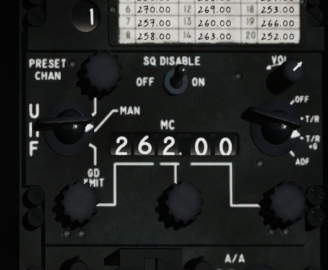

Radio
=====

.. _radio skyhawk:

A4-E Skyhawk
------------

		 
   A4-E Skyhawk UHF panel (right leg)

.. _radio viper:

F-16 Viper
----------

.. CAUTION::
   Make sure the C&I knob on the IFF panel is set to UFC.

- press COM 1 (COM 2) on the ICP

This brings up the UHF (VHF) page on the DED.

- in the scratch pad enter the frequency using the number buttons on the ICP
- press ICP Enter button

