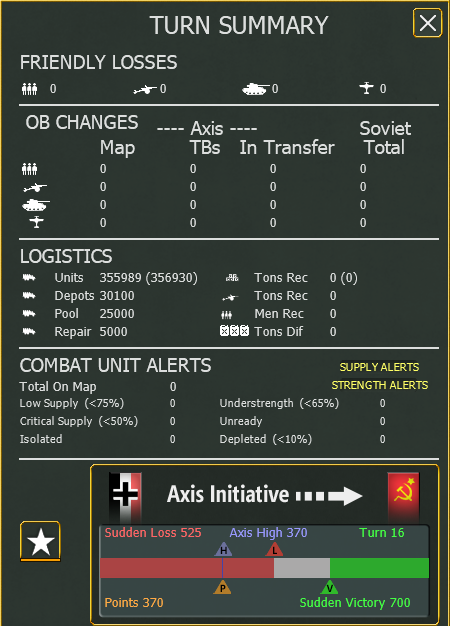

Turn Summary
============

Clicking on the top right X closes the screen. Clicking on Supply Alerts or Strength Alerts toggles highlighting the relevant units on the map. Clicking the bottom left star opens the :ref:`victory-screen`.

Friendly Losses
---------------

OB Changes
----------

This section summarizes changes in the Order of Battle for both sides since the last turn. The changes are broken down into men, guns, tanks, and planes. For the player's side the changes are further subdivided into changes on the map, in theatre boxes and in transfer.

Logistics
---------

This section shows how trucks are allocated, and what happened in the logistics phase. On the left, the truck allocation is listed, stating how many trucks are attached to units, depots, the pool, or in repair. The number in parentheses lists the number of trucks that units need. The right side lists, the supplies, guns, and men received by units this turn. Last, the difference in fuel since the last turn is listed.

Combat Unit Alerts
------------------

Scoring
-------
In the grand campaign, the scoring section displays a bar diagram, outlining the current points and the conditions for an early ending. Concretely, the players current points are displayed as a P-labeled triangle. The high watermark is displayed as a H-labeled triangle. If at the end of the designated turn (here turn 16) the high watermark is below the L-labeled triangle, the scenario ends in that turn with a sudden loss. If at the end of the designated turn the high watermark is above the V-labeled triangle the scenario ends in that turn with a sudden victory.
